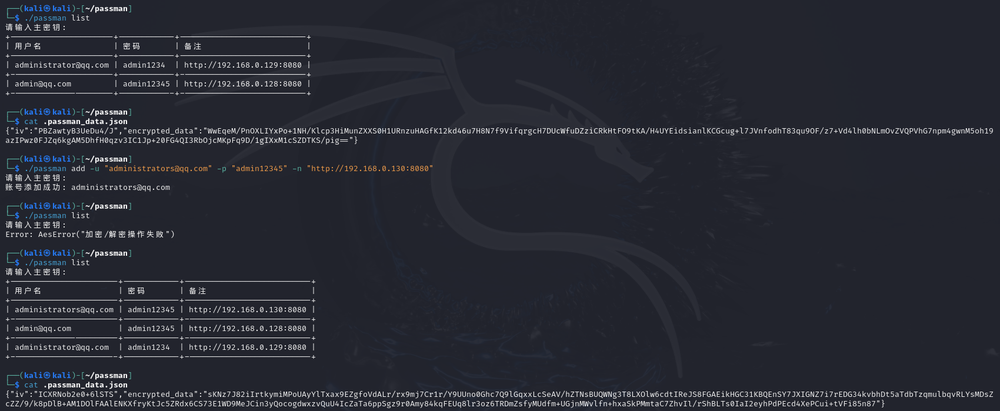

# Passman

Passman 是一个使用 Rust 编写的简单命令行密码管理工具，支持添加、删除、更新和查看密码信息。

## 功能特性

- **添加账号信息**
- **删除账号信息**
- **更新账号信息**
- **查看所有账号信息**
- **查看特定账号信息**

## 安装

### 1. 从源码编译

```
cargo build --release
```

编译完成后，二进制文件位于 `target/release/` 目录下。

### 2. 直接使用已编译的二进制文件

下载编译好的 `passman`（Linux/Mac），并将其放入系统 `PATH` 目录。

## 使用方法

运行以下命令以查看帮助信息：

```
./passman --help
```

### 可用命令

```bash
Usage: ./passman <COMMAND>

Commands:
  add     添加新账号
  delete  删除账号
  update  更新账号信息
  list    查看所有账号信息
  get     查看特定账号信息
  help    查看帮助信息
```

### 示例

主密钥以第一次添加账号输入的密钥为主。

#### 添加新账号

```bash
./passman add -u "my_username" -p "my_password" -n "github"
```

#### 查看所有账号信息

```bash
./passman list
```

#### 获取特定账号信息

```bash
./passman get -u "my_username"
```

#### 更新账号信息

```bash
./passman update -u "my_username" -p "new_password" -n "new_notes"(可选)
```

#### 删除账号

```bash
./passman delete -u "my_username"
```

### 运行截图

